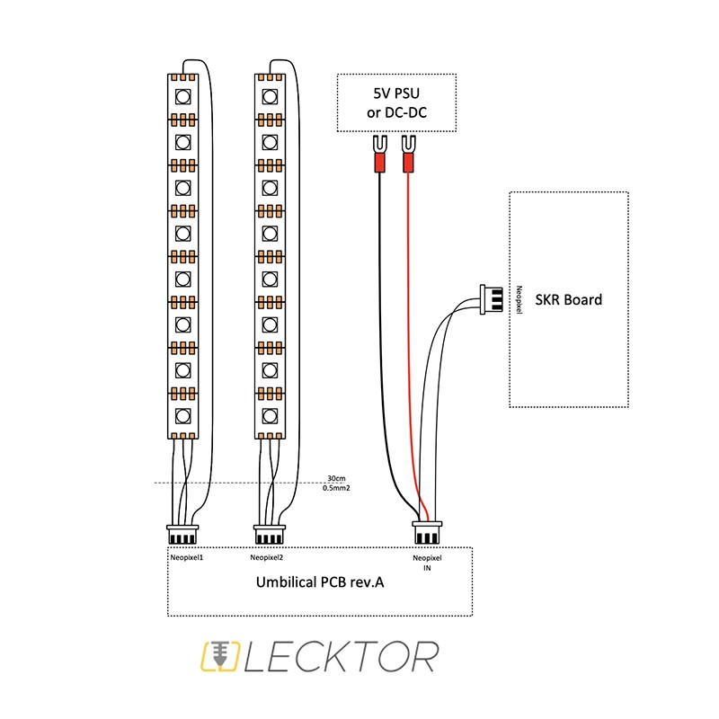
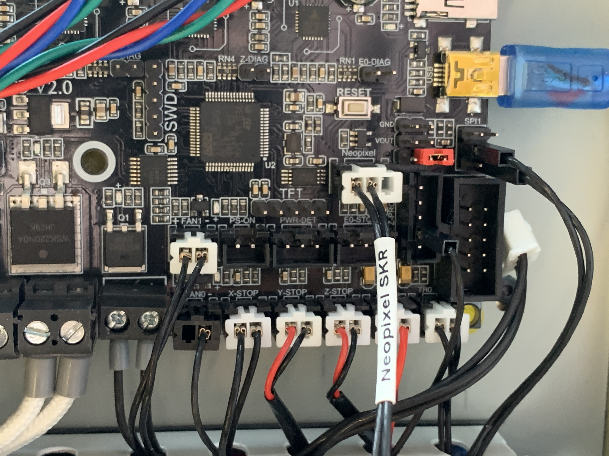
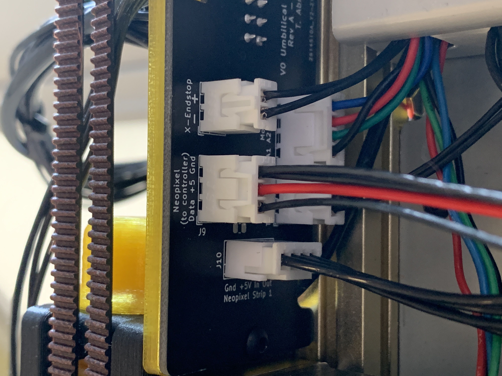
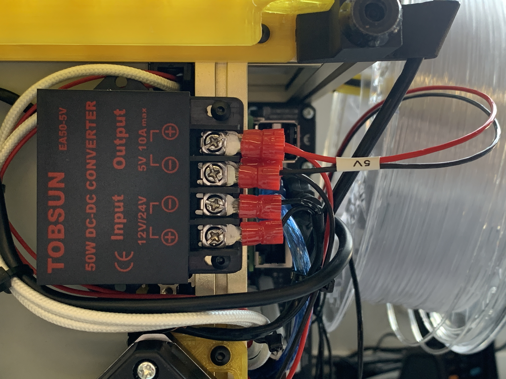

# Voron V0.1 LED Strip Mount design and hardware
This mount was designed for LED strips to illuminate the model while printing and at the same time accent the style with another extrusion and plastic mounts. Also, the profile dissipates heat well on the LED strip in an already warm chamber, this prevents the strip from peeling off and increases its life.

## BOM
+ 2x 150mm of 9.3x16mm Aluminium LED Profiles
+ 8x M3x6 ISO7380-1 Screws
+ 8x M3 Nuts
+ 4x printed parts [Download](/STL)

The aluminium profile: [DRW1](images/drawingProfile.jpg)

Led Kit with RGBNW Neopixels available for purchase [here](https://lecktor.com/en/v0-misc/1014-led-strip-mount-for-voron-v01.html).

## Installation guide:

LogIn to your machine thru SSH.

Execute commands shown below:

    cd ~
    git clone https://github.com/julianschill/klipper-led_effect.git
    cd klipper-led_effect
    ./install-led_effect.sh

Upload [leds.cfg](/Config) file to printer and enable it in printer.cfg adding [include leds.cfg] line.

Connect the leds like shown on pictures:

Change your leds.cfg according to your needs. Documentation: https://github.com/julianschill/klipper-led_effect/blob/master/docs/LED_Effect.md

## Printer tests:

