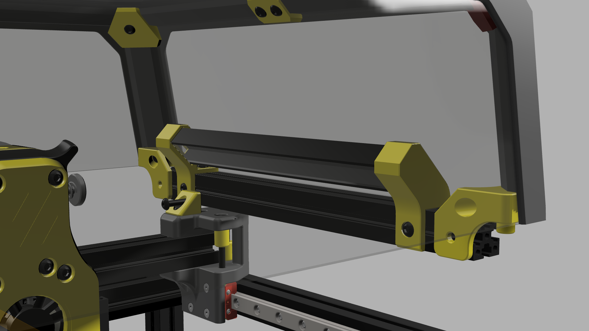
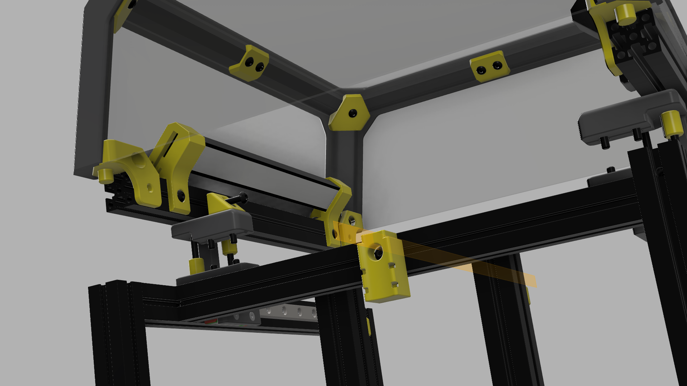
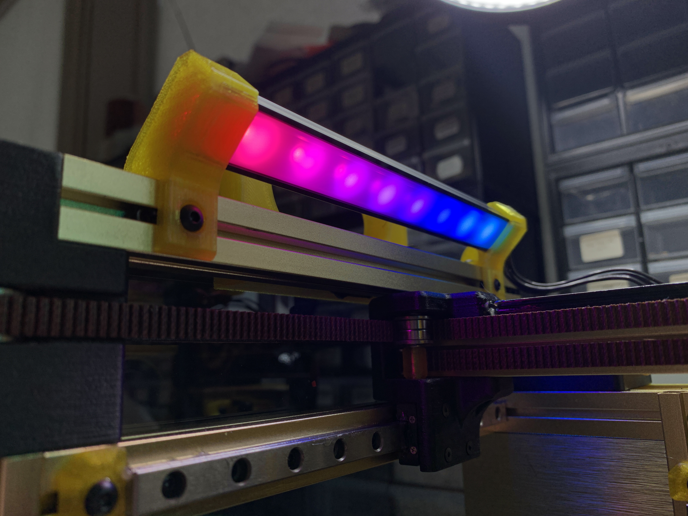
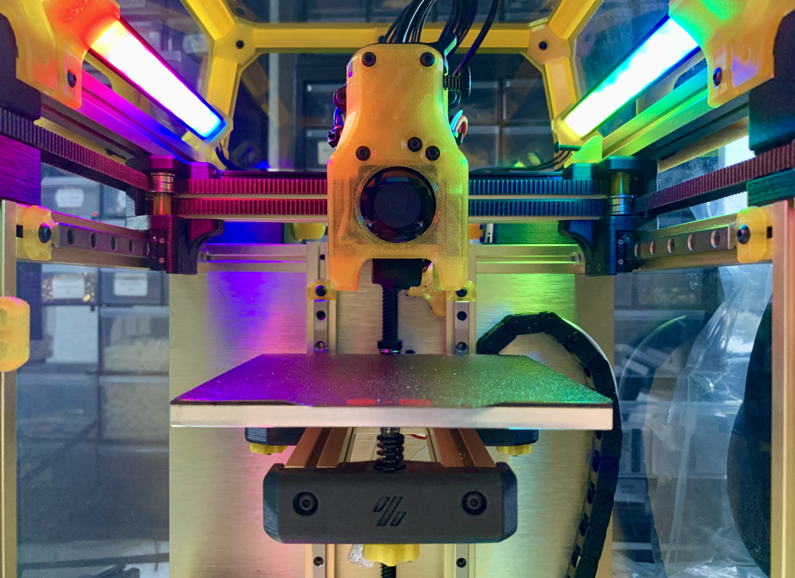
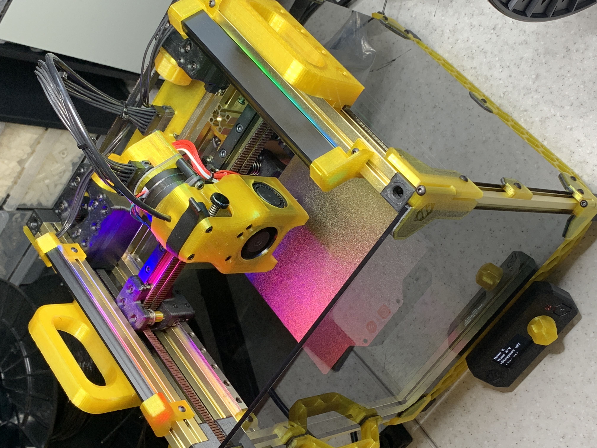

# Voron V0.1 LED Strip Mount design and hardware
This mount was designed for LED strips to illuminate the model while printing and at the same time accent the style with another extrusion and plastic mounts. Also, the profile dissipates heat well on the LED strip in an already warm chamber, this prevents the strip from peeling off and increases its life.

## BOM
+ 2x 150mm of 9.3x16mm Aluminium LED Profile
+ 8x M3x6 BHCS
+ 8x M3 Nut
+ 4x printed parts [Download](/STL)

The aluminium profile this mount is made for looks like: [DRW1](images/drawingProfile.jpg)

Led Kit with RGBNW Neopixels available for purchase [here](https://lecktor.com/en/v0-misc/1014-led-strip-mount-for-voron-v01.html).
## Printer tests:

