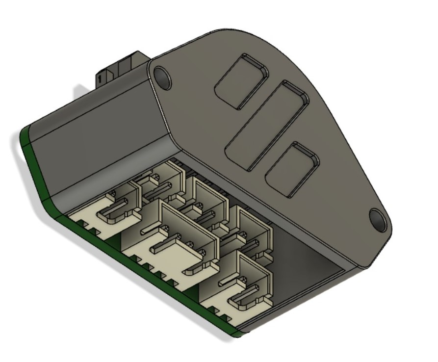
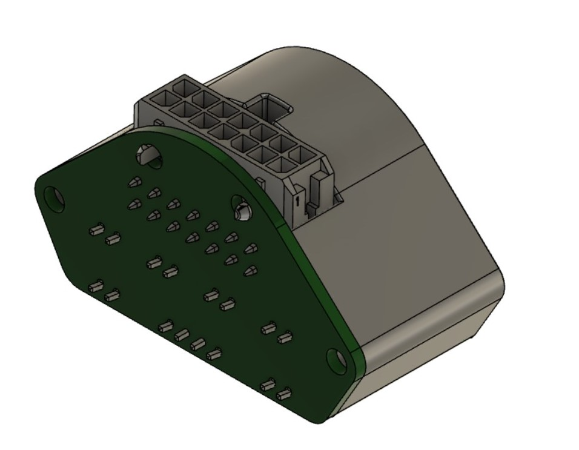
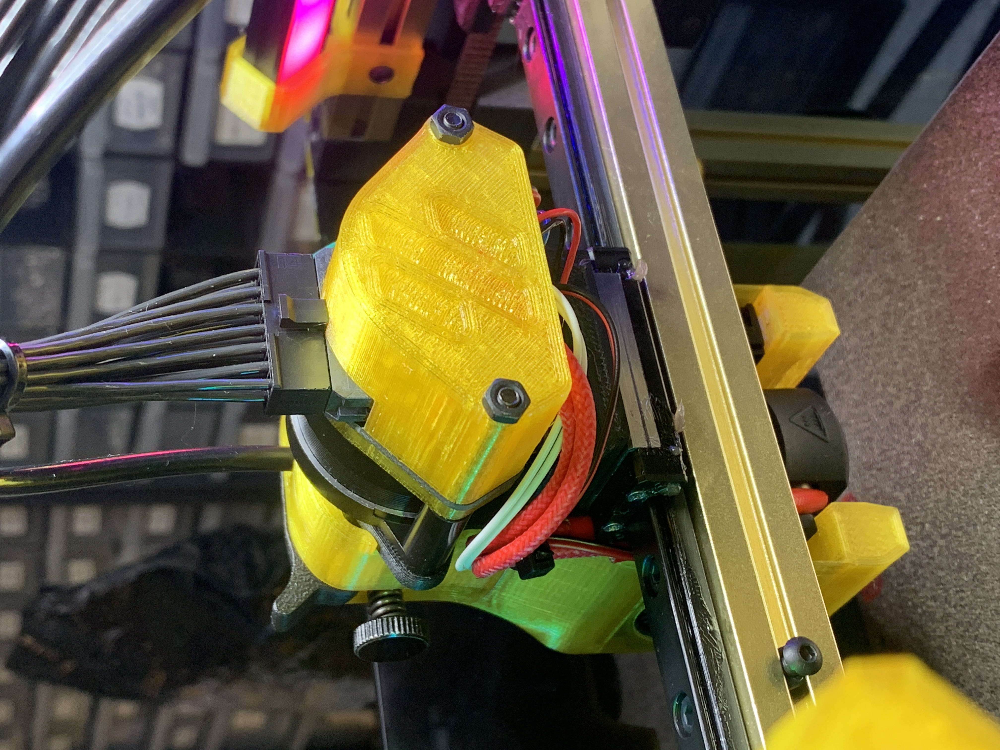

# Voron V0.1 ToolHead PCB Cover design
Connectors cover for Umbilical Toolhead PCB: [link](https://github.com/timmit99/Voron-Hardware/tree/V0-Umbilical/V0-Umbilical)

## Additional BOM:
+ 2x M3x50 Bolts
+ 2x M3 Nuts
+ 2x 15mm Spacers

